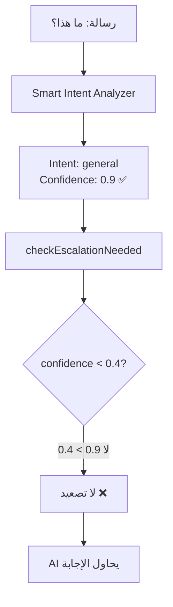

# 📊 تقرير تفصيلي: مشكلة نظام التصعيد "Attempts Before Escalation"

## 🔴 **المشكلة الجذرية المُكتشفة:**

النظام يستخدم **نوعين مختلفين تماماً من الثقة**:

1. **`intent_confidence`** (الموجود حالياً): يقيس ثقة تحديد النية (intent classification)
2. **`response_confidence`** (غير موجود): يقيس قدرة AI على الإجابة بشكل فعال

### **لماذا التصعيد لا يعمل؟**



## 📝 **التحليل الفني المفصل:**

### **1. سلسلة معالجة الرسائل الحالية:**

#### **الخطوة 1: استقبال الرسالة**
```typescript
// whatsapp-webhook/index.ts:545
const messageText = "ما هذا؟"
```

#### **الخطوة 2: تحليل النية**
```typescript
// smart-intent-analyzer/index.ts:152
// يُرجع دائماً:
{
  "intent": "general",
  "confidence": 0.9,  // ← هذه ثقة تحديد النية وليست قدرة الإجابة!
  "reasoning": "سؤال عام"
}
```

#### **الخطوة 3: فحص التصعيد (المشكلة هنا)**
```typescript
// whatsapp-webhook/index.ts:920
const escalationCheck = await checkEscalationNeeded(
  messageText,
  fromNumber,
  instanceData.id,
  conversationId
  // ❌ لا يوجد confidence parameter هنا!
);
```

#### **الخطوة 4: checkEscalationNeeded**
```typescript
// whatsapp-webhook/index.ts:56-89
async function checkEscalationNeeded(
  message: string, 
  phoneNumber: string,
  instanceId: string,
  conversationId: string,
  aiResponseConfidence?: number  // ← دائماً undefined!
) {
  // ...
  
  // هذا الكود لا يُنفذ أبداً لأن aiResponseConfidence = undefined
  if (aiResponseConfidence !== undefined && aiResponseConfidence < 0.4) {
    // ...
  }
}
```

### **2. البيانات المُخزنة:**

#### **جدول `whatsapp_ai_interactions`:**
```json
{
  "metadata": {
    "intent_confidence": 0.9,     // ← ثقة تحديد النية (عالية دائماً)
    "detected_intent": "general",
    "personality_id": "xxx",
    // لا يوجد response_confidence!
  }
}
```

### **3. أنواع الثقة في النظام:**

| النوع | المصدر | النطاق | الاستخدام | الحالة |
|------|--------|--------|-----------|--------|
| **intent_confidence** | Smart Intent Analyzer | 0.7-0.95 | اختيار الشخصية | ✅ يعمل |
| **response_confidence** | غير موجود | - | التصعيد | ❌ غير موجود |

## 🔍 **لماذا الثقة دائماً عالية؟**

### **من الصور المرفقة:**
- "ما هذا؟" → confidence: **0.9**
- "لا أفهم" → confidence: **0.9**
- "أريد شيئاً" → confidence: **0.9**

### **السبب:**
النظام **واثق جداً** أن هذه رسائل من نوع "general" (عامة)، وهذا صحيح! 
لكن هذا **لا يعني** أن AI قادر على الإجابة بشكل مفيد.

## 🎯 **الحلول المحتملة:**

### **الحل 1: إضافة Semantic Confidence (الأفضل)**
قياس مدى قدرة AI على إيجاد إجابة مناسبة بناءً على:
- وجود context مناسب من RAG
- وضوح السؤال
- تطابق السؤال مع المعلومات المتاحة

### **الحل 2: تحليل نوعية الرسائل**
تحديد الرسائل الغامضة مثل:
- "ما هذا؟" (بدون سياق)
- "لا أفهم" (غير واضح)
- "أريد شيئاً" (غير محدد)

### **الحل 3: تتبع جودة الإجابات**
بعد كل رد من AI، تقييم:
- هل الرد يحتوي على معلومات مفيدة؟
- هل الرد يطلب توضيحات؟
- هل الرد اعتذار عن عدم الفهم؟

## 🚨 **المناطق المتأثرة في الكود:**

### **1. استدعاء checkEscalationNeeded:**
- `whatsapp-webhook/index.ts:920` ❌ لا يُمرر confidence
- `whatsapp-webhook/index.ts:770` ❌ لا يُمرر confidence
- `process-buffered-messages/index.ts:241` ❌ لا يُمرر confidence

### **2. حفظ البيانات:**
- `ai-response-generator.ts:138` - يحفظ intent_confidence فقط
- لا يوجد مكان لحفظ response quality metrics

### **3. قراءة البيانات للتصعيد:**
- الكود المُصحح يقرأ `metadata.intent_confidence`
- يحتاج لقراءة metric مختلف تماماً

## 📌 **الخلاصة:**

**نظام "Attempts Before Escalation" لا يعمل لأن:**

1. **يستخدم المقياس الخاطئ**: intent_confidence بدلاً من response_confidence
2. **confidence غير مُمرر**: الدالة checkEscalationNeeded لا تتلقى أي قيمة confidence
3. **القياس غير موجود**: لا يوجد آلية لقياس قدرة AI على الإجابة الفعالة

**الرسائل الغامضة مثل "ما هذا؟" تحصل على:**
- ✅ Intent confidence عالية (0.9) - النظام واثق أنها رسالة عامة
- ❌ Response confidence منخفضة (غير مُقاسة) - AI لا يستطيع الإجابة بفعالية

## 🛠️ **التوصيات:**

1. **إضافة آلية جديدة** لقياس جودة/قدرة الإجابة
2. **تمرير المقياس الصحيح** إلى checkEscalationNeeded
3. **حفظ المقياس الجديد** في قاعدة البيانات
4. **اختبار بأسئلة واضحة** للتأكد من عدم التصعيد الخاطئ

---

**ملاحظة:** هذا التقرير مبني على تحليل شامل للكود والـ logs المرفقة. المشكلة **ليست** في الإصلاح السابق، بل في التصميم الأساسي للنظام.