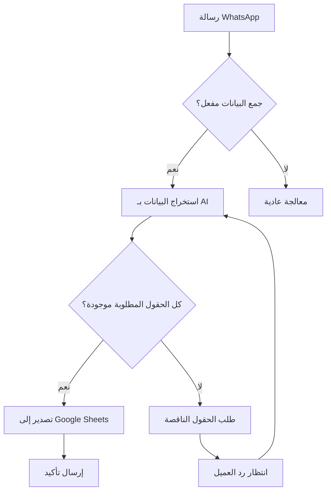

# 📊 ConvGo Data Collection Feature

## نظرة عامة (Overview)

ميزة جمع البيانات الديناميكية من محادثات WhatsApp وتصديرها تلقائيًا إلى Google Sheets. تسمح هذه الميزة لكل مستخدم بتحديد الحقول المخصصة التي يريد جمعها من عملائه.

## 🚀 المميزات الرئيسية

### 1. **تكوين الحقول المخصصة**
- إنشاء حقول ديناميكية (اسم، هاتف، إيميل، عنوان، إلخ)
- دعم أنواع بيانات متعددة (نص، رقم، تاريخ، boolean)
- تحديد الحقول المطلوبة والاختيارية
- دعم اللغة العربية والإنجليزية

### 2. **الاستخراج الذكي للبيانات**
- استخدام AI لاستخراج البيانات من الرسائل
- التعرف التلقائي على الحقول من السياق
- طلب الحقول الناقصة بشكل ذكي
- التحقق من صحة البيانات

### 3. **التصدير التلقائي**
- تصدير فوري عند اكتمال البيانات
- دعم التصدير اليدوي
- تتبع حالة التصدير
- إعادة المحاولة عند الفشل

## 📋 كيفية الاستخدام

### الخطوة 1: الإعداد الأولي

1. **انتقل إلى صفحة Data Collection**
   - من القائمة الجانبية، اختر "Data Collection"

2. **اختر رقم WhatsApp**
   - حدد الرقم الذي تريد تفعيل جمع البيانات عليه

3. **اربط حساب Google**
   - اضغط على "Connect with Google"
   - سجل الدخول بحساب Google
   - امنح الصلاحيات المطلوبة

4. **حدد Google Sheet**
   - الصق رابط أو معرف Google Sheet
   - حدد اسم التبويب (Sheet Tab)

### الخطوة 2: تكوين الحقول

1. **أضف حقل جديد**
   ```
   اضغط على "Add New Field"
   ```

2. **املأ تفاصيل الحقل:**
   - **Field Name**: الاسم الداخلي (مثل: customer_name)
   - **Display Name**: الاسم الظاهر بالإنجليزية
   - **Display Name Arabic**: الاسم الظاهر بالعربية
   - **Field Type**: نوع البيانات
   - **Required**: هل الحقل مطلوب؟
   - **Keywords**: كلمات مفتاحية للتعرف على الحقل
   - **Extraction Prompt**: تعليمات مخصصة للاستخراج
   - **Missing Field Message**: رسالة مخصصة للحقول الناقصة

3. **رتب الحقول**
   - استخدم السحب والإفلات لترتيب الحقول

### الخطوة 3: تفعيل جمع البيانات

1. في قسم "Data Collection Status"، اضغط "Enable"
2. سيبدأ النظام في جمع البيانات من المحادثات الجديدة

### الخطوة 4: مراقبة البيانات

1. **عرض البيانات المجمعة**
   - انتقل إلى تبويب "Collected Data"
   - شاهد جميع جلسات جمع البيانات
   - فلتر حسب الحالة (مكتملة، غير مكتملة، مُصدرة)

2. **تصدير البيانات**
   - التصدير التلقائي عند اكتمال البيانات
   - أو اضغط "Export All" للتصدير اليدوي

## 🔧 أمثلة على الحقول

### مثال 1: نموذج طلب منتج
```javascript
{
  fields: [
    { name: "customer_name", type: "text", required: true },
    { name: "phone", type: "phone", required: true },
    { name: "product", type: "text", required: true },
    { name: "quantity", type: "number", required: true },
    { name: "address", type: "address", required: true },
    { name: "notes", type: "text", required: false }
  ]
}
```

### مثال 2: نموذج حجز موعد
```javascript
{
  fields: [
    { name: "patient_name", type: "text", required: true },
    { name: "phone", type: "phone", required: true },
    { name: "preferred_date", type: "date", required: true },
    { name: "preferred_time", type: "text", required: true },
    { name: "reason", type: "text", required: false }
  ]
}
```

## 🎯 سيناريوهات الاستخدام

### 1. **التجارة الإلكترونية**
- جمع بيانات الطلبات
- معلومات الشحن
- تفضيلات المنتجات

### 2. **الخدمات الطبية**
- حجز المواعيد
- بيانات المرضى
- الاستفسارات الطبية

### 3. **العقارات**
- طلبات المعاينة
- تفضيلات العملاء
- بيانات التواصل

### 4. **التعليم**
- تسجيل الطلاب
- الاستفسارات عن الدورات
- طلبات المعلومات

## 🔄 تدفق العمل (Workflow)



## ⚙️ الإعدادات المتقدمة

### قواعد التحقق (Validation Rules)
```json
{
  "validation_rules": {
    "regex": "^[0-9]{11}$",
    "error_message": "رقم الهاتف يجب أن يكون 11 رقم"
  }
}
```

### قوالب الاستخراج المخصصة
```text
استخرج اسم العميل الكامل من الرسالة. 
ابحث عن الاسم بعد كلمات مثل "اسمي" أو "أنا" أو "الاسم".
```

### رسائل الحقول الناقصة
```text
عربي: "من فضلك، هل يمكنك إخباري برقم هاتفك للتواصل؟"
English: "Could you please provide your phone number?"
```

## 📊 تنسيق Google Sheet

سيتم إنشاء الأعمدة التالية تلقائيًا:

| Timestamp | Phone Number | Conversation ID | [حقولك المخصصة...] |
|-----------|--------------|-----------------|-------------------|
| 2024-01-04 10:30 | +201234567890 | conv_123 | قيم البيانات |

## 🔒 الأمان والخصوصية

- **تشفير البيانات**: جميع tokens مشفرة
- **عزل المستخدمين**: كل مستخدم يرى بياناته فقط
- **صلاحيات محدودة**: صلاحيات Google محدودة للـ Sheets فقط
- **سجل المراجعة**: تتبع جميع عمليات التصدير

## 🚨 استكشاف الأخطاء

### المشكلة: "لا يمكن الاتصال بـ Google"
**الحل:**
1. تأكد من إعدادات Google OAuth
2. تحقق من صلاحيات التطبيق
3. أعد المحاولة بحساب آخر

### المشكلة: "فشل التصدير إلى Sheets"
**الحل:**
1. تأكد من صحة معرف الـ Sheet
2. تحقق من صلاحيات الكتابة
3. تأكد من اتصال الإنترنت

### المشكلة: "الحقول لا يتم استخراجها"
**الحل:**
1. راجع الكلمات المفتاحية
2. أضف prompt مخصص
3. تأكد من تفعيل جمع البيانات

## 📈 الإحصائيات والتقارير

تابع أداء جمع البيانات من خلال:
- عدد الجلسات المكتملة
- معدل إكمال الحقول
- الوقت المتوسط للإكمال
- معدل نجاح التصدير

## 🔮 التطويرات المستقبلية

- **تكاملات إضافية**: HubSpot, Zoho CRM, Airtable
- **قوالب جاهزة**: قوالب لصناعات مختلفة
- **Webhooks**: إشعارات فورية عند اكتمال البيانات
- **تصدير متعدد**: تصدير لأكثر من وجهة
- **تحليلات متقدمة**: تقارير تفصيلية وإحصائيات

## 📞 الدعم

للمساعدة أو الإبلاغ عن مشاكل:
- تحقق من سجلات النظام في Supabase Dashboard
- راجع سجلات Edge Functions
- تواصل مع الدعم الفني

## 📝 ملاحظات مهمة

1. **الحد الأقصى للحقول**: يُنصح بعدم تجاوز 20 حقل
2. **حجم البيانات**: الحد الأقصى 1MB لكل جلسة
3. **معدل الطلبات**: 100 طلب تصدير في الساعة
4. **الاحتفاظ بالبيانات**: 90 يوم للجلسات غير المُصدرة

---

صُمم بـ ❤️ لـ ConvGo - منصة WhatsApp AI الذكية