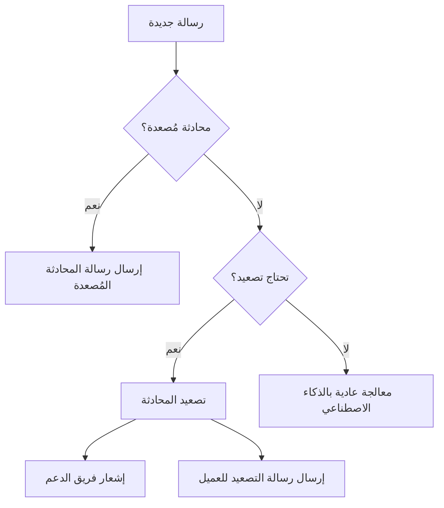

# 📚 نظام التصعيد الذكي للدعم البشري - ConvGo

## 🎯 نظرة عامة
نظام تصعيد ذكي ومتطور يحدد تلقائياً متى تحتاج المحادثة للتدخل البشري، مع إمكانية التصعيد اليدوي عند الطلب.

## ✨ المميزات الرئيسية

### 1. التصعيد الذكي التلقائي
- **كشف الكلمات المفتاحية**: يتعرف على طلبات الدعم البشري تلقائياً
- **تحليل الثقة**: يراقب مستوى ثقة الذكاء الاصطناعي في الإجابات
- **كشف التكرار**: يتعرف على الأسئلة المتكررة
- **المواضيع الحساسة**: يتعرف على الشكاوى والمسائل القانونية

### 2. إدارة فريق الدعم
- إضافة أرقام دعم متعددة
- تفعيل/تعطيل أرقام بشكل فردي
- إرسال تنبيهات فورية مع روابط wa.me
- متابعة حالة كل رقم

### 3. متابعة المحادثات المُصعدة
- عرض قائمة المحادثات النشطة
- السياق الكامل للمحادثة
- إحصائيات الأداء
- إمكانية حل التصعيد بنقرة واحدة

## 🛠️ التكوين والإعداد

### إعداد قاعدة البيانات
قم بتشغيل migration الموجود في:
```bash
supabase/migrations/create_escalation_system_tables.sql
```

### تكوين الواجهة الأمامية

#### صفحة إعدادات التصعيد (`/escalation-settings`)
- إدارة أرقام فريق الدعم
- تخصيص رسائل التصعيد
- ضبط معايير التصعيد التلقائي
- تحديد الكلمات المفتاحية

#### صفحة المحادثات المُصعدة (`/escalated-conversations`)
- عرض المحادثات النشطة والمحلولة
- إحصائيات الأداء
- إدارة التصعيدات

## 📋 معايير التصعيد

### التصعيد المباشر
يتم التصعيد فوراً عند:
- طلب صريح من العميل ("أريد التحدث مع موظف")
- كلمات مفتاحية محددة مسبقاً

### التصعيد التلقائي
يتم بناءً على:
- **ثقة منخفضة**: أقل من 40% في 3 رسائل متتالية
- **أسئلة متكررة**: نفس السؤال 3 مرات أو أكثر
- **مواضيع حساسة**: شكاوى، مسائل قانونية، طلبات استرجاع

## 🔄 سير العمل



## 📊 الإحصائيات المتاحة

- عدد المحادثات المُصعدة النشطة
- متوسط وقت الحل
- أكثر أسباب التصعيد شيوعاً
- معدل التصعيد اليومي

## 🔧 Edge Functions

### `send-escalation-notification`
- إرسال تنبيهات فورية لفريق الدعم
- تضمين رابط wa.me للرد المباشر
- حفظ سياق المحادثة

## 📝 الرسائل القابلة للتخصيص

### رسالة التصعيد
```
تم تحويل محادثتك إلى فريق الدعم المتخصص. سيتواصل معك أحد ممثلينا قريباً.
```

### رسالة المحادثة المُصعدة
```
محادثتك قيد المراجعة من فريق الدعم. سنتواصل معك قريباً.
```

## 🚀 البدء السريع

1. **تشغيل Migrations**:
```bash
supabase db push
```

2. **إضافة أرقام الدعم**:
- انتقل إلى `/escalation-settings`
- أضف أرقام WhatsApp لفريق الدعم

3. **تكوين الرسائل**:
- خصص رسائل التصعيد حسب احتياجاتك
- حدد الكلمات المفتاحية للتصعيد

4. **المتابعة**:
- راقب المحادثات المُصعدة من `/escalated-conversations`
- احصل على تنبيهات فورية عند التصعيد

## 🔐 الأمان والصلاحيات

- Row Level Security مفعّل على جميع الجداول
- المستخدمون يرون فقط بياناتهم
- التصعيدات مرتبطة بحسابات WhatsApp المملوكة

## 📱 التكامل مع WhatsApp

النظام يتكامل بسلاسة مع:
- Baileys/Evolution API
- رسائل WhatsApp النصية والصوتية
- الصور والوسائط المتعددة

## 🎨 واجهة المستخدم

- تصميم عصري وسهل الاستخدام
- شارات تنبيه للمحادثات النشطة
- إحصائيات في الوقت الفعلي
- دعم الوضع الداكن

## 💡 نصائح للاستخدام الأمثل

1. **حدد الكلمات المفتاحية بدقة**: اختر كلمات واضحة تدل على الحاجة للدعم البشري
2. **راقب الإحصائيات**: استخدمها لتحسين أداء الذكاء الاصطناعي
3. **استجب بسرعة**: التصعيدات تحتاج استجابة سريعة
4. **درّب الفريق**: تأكد أن فريق الدعم يفهم النظام

## 🐛 استكشاف الأخطاء

### لا تصل التنبيهات
- تأكد من صحة أرقام WhatsApp
- تحقق من تفعيل الأرقام
- راجع سجلات Edge Functions

### التصعيد لا يعمل
- تأكد من تفعيل التصعيد للـ instance
- راجع الكلمات المفتاحية
- تحقق من معايير التصعيد

## 📞 الدعم

للمساعدة أو الإبلاغ عن مشكلة:
- افتح issue على GitHub
- تواصل مع فريق الدعم الفني