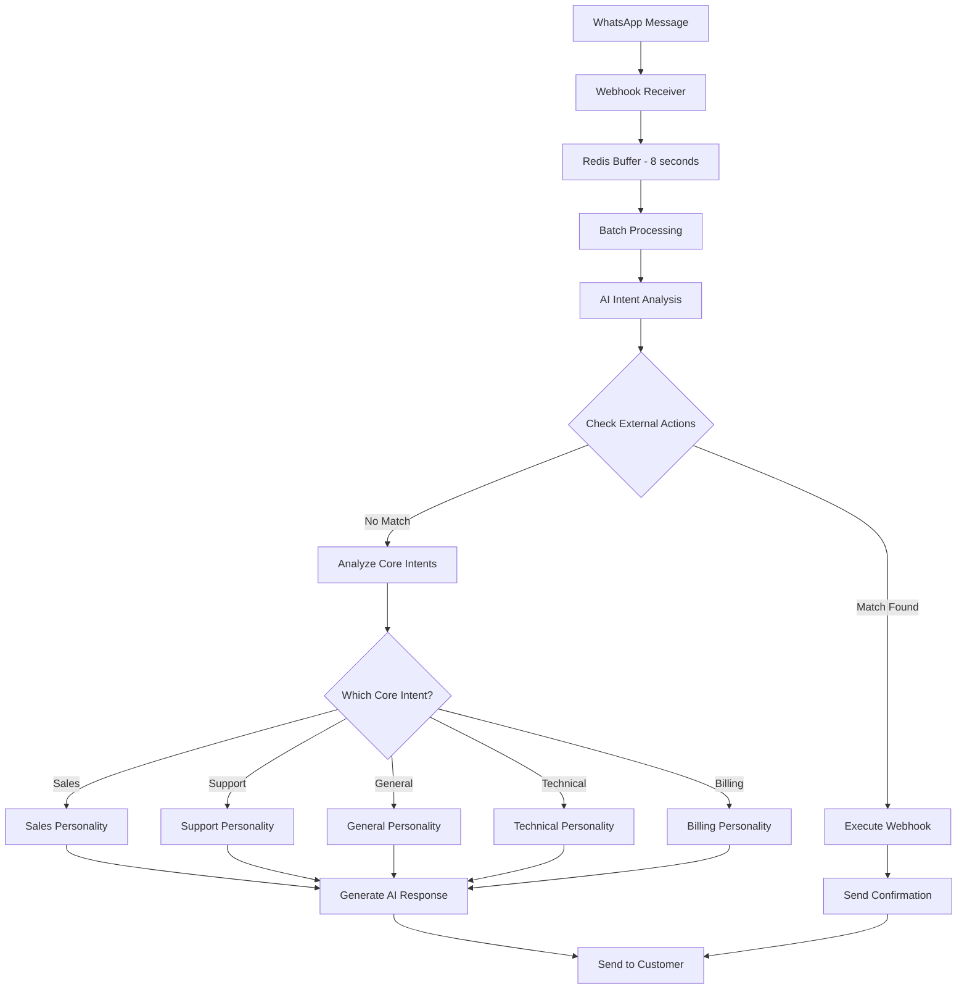

# 🎯 External Actions Feature - Simplified Implementation Plan
# خطة مبسطة لتنفيذ ميزة External Actions لمنصة ConvGo

## 📋 Table of Contents
1. [Executive Summary](#executive-summary)
2. [Core Concept](#core-concept)
3. [System Architecture](#system-architecture)
4. [Database Schema](#database-schema)
5. [Implementation Phases](#implementation-phases)
6. [UI Components](#ui-components)
7. [Testing Strategy](#testing-strategy)
8. [Rollout Plan](#rollout-plan)

---

## Executive Summary

### 🎯 Goal
Enable ConvGo users to create **additional custom intents** (External Actions) that execute webhooks to external systems (Zapier, n8n, Make, etc.), while keeping the **5 core intents unchanged**.

### ✨ Key Principles
- **5 Core Intents remain FIXED**: sales, support, general, technical, billing (for personality routing)
- **External Actions are ADDITIONAL**: User-defined intents for webhook execution
- **NO changes to message flow**: All messages go through 8-second buffering
- **AI-powered detection**: No keywords needed, AI learns from examples
- **Simple integration**: External Actions checked first, then core intents

### 📊 System Overview
```
Current: 5 Fixed Intents → Route to AI Personalities
New:     5 Fixed Intents + Unlimited External Actions → Webhooks OR Personalities
```

---

## Core Concept

### The Two-Layer Intent System

#### Layer 1: External Actions (User-Defined)
- Custom intents created by users
- Each triggers a specific webhook
- Unlimited number can be created
- **Checked FIRST by AI**

#### Layer 2: Core Intents (Fixed)
- The 5 essential intents (sales, support, general, technical, billing)
- Used for personality routing
- **Cannot be modified**
- **Checked if no External Action matches**

### Processing Flow
```javascript
async function processMessage(message) {
  // Step 1: Check External Actions FIRST
  const externalAction = await checkExternalActions(message);
  if (externalAction) {
    return executeWebhook(externalAction, message);
  }
  
  // Step 2: Fall back to Core Intents
  const coreIntent = await analyzeCoreIntent(message); // Returns one of 5
  return routeToPersonality(coreIntent);
```

---

## System Architecture

### Complete Flow Diagram


### Key Components

#### 1. Enhanced Intent Analyzer
```typescript
async function analyzeIntent(message: string, instanceId: string) {
  // Get user's external actions
  const externalActions = await getUserExternalActions(instanceId);
  
  // First check: External Actions
  if (externalActions.length > 0) {
    const prompt = `
      Check if this message matches any of these external actions:
      ${externalActions.map(a => `- ${a.display_name}: ${a.description}`).join('\n')}
      
      Training examples for each action are provided.
      Message: "${message}"
      
      Return the action_id if matched, or null if no match.
    `;
    
    const matchedAction = await callOpenAI(prompt);
    if (matchedAction) {
      return { type: 'external_action', actionId: matchedAction };
    }
  }
  
  // Second check: Core Intents (existing system)
  const coreIntent = await analyzeCoreIntent(message);
  return { type: 'core_intent', intent: coreIntent };
}
```

#### 2. External Action Executor
```typescript
async function executeExternalAction(action: ExternalAction, message: string, context: any) {
  // Extract variables using AI
  const variables = await extractVariables(message, action.variable_prompts);
  
  // Build payload from template
  const payload = buildPayload(action.payload_template, {
    phone_number: context.phoneNumber,
    message_text: message,
    timestamp: new Date().toISOString(),
    ...variables
  });
  
  // Execute webhook with retry logic
  let attempt = 0;
  while (attempt < action.max_retries) {
    try {
      const response = await fetch(action.webhook_url, {
        method: action.http_method,
        headers: JSON.parse(action.headers || '{}'),
        body: JSON.stringify(payload),
        timeout: 5000
      });
      
      if (response.ok) {
        // Log success
        await logExecution(action.id, 'success', payload, response);
        return action.success_message;
      }
    } catch (error) {
      attempt++;
      if (attempt >= action.max_retries) {
        // Log failure
        await logExecution(action.id, 'failed', payload, error);
        return action.failure_message;
      }
      await sleep(1000); // Wait before retry
    }
  }
}
```

---

## Database Schema

### 1. External Actions Table (User-Defined Intents)
```sql
CREATE TABLE external_actions (
    id UUID PRIMARY KEY DEFAULT gen_random_uuid(),
    user_id UUID REFERENCES auth.users(id),
    whatsapp_instance_id UUID REFERENCES whatsapp_instances(id),
    
    -- Action Identity
    action_name VARCHAR(100) NOT NULL,          -- Internal ID: "create_order"
    display_name VARCHAR(255) NOT NULL,         -- UI Display: "Create Shopify Order"
    description TEXT,                            -- For AI understanding
    icon VARCHAR(50),                            -- Optional icon for UI
    
    -- AI Training (No Keywords!)
    training_examples JSONB NOT NULL,           -- Array of example messages
    -- Example: [
    --   {"text": "I want to order iPhone", "language": "en"},
    --   {"text": "أريد طلب آيفون", "language": "ar"},
    --   {"text": "Please create an order for 3 laptops", "language": "en"}
    -- ]
    
    -- Webhook Configuration
    webhook_url TEXT NOT NULL,
    http_method VARCHAR(10) DEFAULT 'POST',
    headers JSONB DEFAULT '{}',
    
    -- Payload Configuration
    payload_template JSONB NOT NULL,            -- Template with {{variables}}
    variable_prompts JSONB,                     -- AI prompts for extraction
    -- Example: {
    --   "product_name": "Extract the product name from the message",
    --   "quantity": "Extract the quantity (default to 1 if not specified)"
    -- }
    
    -- Response Messages
    success_message TEXT DEFAULT 'Action completed successfully',
    failure_message TEXT DEFAULT 'Sorry, an error occurred',
    
    -- Settings
    is_active BOOLEAN DEFAULT true,
    priority INTEGER DEFAULT 0,                 -- Higher priority checked first
    confidence_threshold DECIMAL(3,2) DEFAULT 0.80,
    requires_confirmation BOOLEAN DEFAULT false,
    confirmation_message TEXT,
    
    -- Retry Configuration
    retry_on_failure BOOLEAN DEFAULT true,
    max_retries INTEGER DEFAULT 3,
    retry_delay_seconds INTEGER DEFAULT 1,
    
    -- Statistics
    execution_count INTEGER DEFAULT 0,
    success_count INTEGER DEFAULT 0,
    failure_count INTEGER DEFAULT 0,
    last_executed_at TIMESTAMPTZ,
    average_response_time_ms INTEGER,
    
    created_at TIMESTAMPTZ DEFAULT NOW(),
    updated_at TIMESTAMPTZ DEFAULT NOW(),
    
    UNIQUE(user_id, whatsapp_instance_id, action_name)
);

-- Indexes for performance
CREATE INDEX idx_external_actions_active 
    ON external_actions(whatsapp_instance_id, is_active, priority DESC);
CREATE INDEX idx_external_actions_user 
    ON external_actions(user_id);
```

### 2. Execution Logs Table
```sql
CREATE TABLE external_action_logs (
    id UUID PRIMARY KEY DEFAULT gen_random_uuid(),
    action_id UUID REFERENCES external_actions(id) ON DELETE CASCADE,
    whatsapp_instance_id UUID NOT NULL,
    conversation_id TEXT NOT NULL,
    phone_number TEXT NOT NULL,
    
    -- Message Details
    original_message TEXT NOT NULL,
    detected_confidence DECIMAL(3,2),
    
    -- Execution Details
    payload_sent JSONB,
    response_received JSONB,
    response_status_code INTEGER,
    
    -- Status
    status VARCHAR(50) NOT NULL, -- pending, success, failed, timeout
    error_message TEXT,
    execution_time_ms INTEGER,
    retry_count INTEGER DEFAULT 0,
    
    created_at TIMESTAMPTZ DEFAULT NOW()
);

-- Indexes
CREATE INDEX idx_action_logs_action ON external_action_logs(action_id);
CREATE INDEX idx_action_logs_status ON external_action_logs(status);
CREATE INDEX idx_action_logs_created ON external_action_logs(created_at DESC);

### 3. Core Intents Table (EXISTING - No Changes)
```sql
-- This table already exists and remains UNCHANGED
-- intent_categories table with 5 fixed intents:
-- 1. sales
-- 2. support  
-- 3. general
-- 4. technical
-- 5. billing
```

---

## Implementation Phases

### Phase 1: Backend Infrastructure (5 days)

#### Day 1-2: Database & Core Functions
- [ ] Create `external_actions` table
- [ ] Create `external_action_logs` table
- [ ] Set up RLS policies
- [ ] Create indexes

#### Day 3-4: Edge Functions
- [ ] Create `external-action-executor` function
- [ ] Enhance `smart-intent-analyzer` to check external actions first
- [ ] Add variable extraction logic
- [ ] Implement webhook execution with retries

#### Day 5: Integration
- [ ] Modify `process-buffered-messages` to handle external actions
- [ ] Update response flow to branch correctly
- [ ] Test with existing buffering system
- [ ] Ensure backward compatibility

### Phase 2: Frontend Development (5 days)

#### Day 1-2: External Actions Management Page
```typescript
// New page: /external-actions
interface ExternalActionsPage {
  // List view
  actionsList: ExternalAction[];
  
  // Actions
  onCreate: () => void;
  onEdit: (id: string) => void;
  onDelete: (id: string) => void;
  onTest: (id: string) => void;
  onToggle: (id: string, active: boolean) => void;
  onViewLogs: (id: string) => void;
}
```

#### Day 3-4: Action Builder Interface
```typescript
interface ActionBuilder {
  // Step 1: Basic Information
  basicInfo: {
    actionName: string;        // "create_order"
    displayName: string;       // "Create Shopify Order"
    description: string;       // "Creates a new order in Shopify when customer requests"
    icon?: string;            // Optional icon selection
  };
  
  // Step 2: Training Examples (NOT Keywords!)
  training: {
    examples: Array<{
      text: string;           // "I want to buy 3 iPhones"
      language: 'ar' | 'en';  // Language of example
    }>;
    // Minimum 5 examples recommended
  };
  
  // Step 3: Webhook Configuration
  webhook: {
    url: string;              // "https://hooks.zapier.com/..."
    method: 'POST' | 'GET' | 'PUT' | 'PATCH';
    headers?: Record<string, string>;
    authentication?: {
      type: 'none' | 'bearer' | 'api_key';
      value?: string;
    };
  };
  
  // Step 4: Payload & Variables
  payload: {
    template: object;         // JSON template
    variables: Array<{
      name: string;           // "product_name"
      prompt: string;         // "Extract the product name"
      required: boolean;
      defaultValue?: string;
    }>;
  };
  
  // Step 5: Messages & Settings
  settings: {
    successMessage: string;
    failureMessage: string;
    requiresConfirmation: boolean;
    confirmationMessage?: string;
    retryOnFailure: boolean;
    maxRetries: number;
  };
}
```

#### Day 5: Testing Interface
```typescript
interface ActionTester {
  // Test input
  testMessage: string;
  
  // Results display
  detectionResult: {
    matched: boolean;
    confidence: number;
    extractedVariables: Record<string, any>;
  };
  
  // Payload preview
  payloadPreview: object;
  
  // Test execution
  executeTest: () => Promise<{
    success: boolean;
    response: any;
    executionTime: number;
  }>;
}
```

### Phase 3: Testing & Documentation (5 days)

#### Testing Strategy
1. **Unit Tests**
   - External action detection
   - Variable extraction
   - Webhook execution
   - Retry logic

2. **Integration Tests**
   - Full flow through buffering
   - Correct branching (external vs core)
   - Error handling

3. **End-to-End Tests**
   - Real WhatsApp messages
   - Real webhook endpoints
   - Performance under load

---

## UI Components

### External Actions Dashboard
```typescript
// Main dashboard showing all external actions
<div className="external-actions-dashboard">
  {/* Header */}
  <div className="header">
    <h1>External Actions</h1>
    <p>Create custom actions that trigger webhooks based on customer messages</p>
    <Button onClick={createNew}>+ Create New Action</Button>
  </div>
  
  {/* Actions Grid */}
  <div className="actions-grid">
    {actions.map(action => (
      <ActionCard
        key={action.id}
        action={action}
        onEdit={() => editAction(action.id)}
        onTest={() => testAction(action.id)}
        onToggle={(active) => toggleAction(action.id, active)}
        onViewLogs={() => viewLogs(action.id)}
      />
    ))}
  </div>
</div>
```

### Action Creation Flow
```
Step 1: Name Your Action
  - Internal name (for system)
  - Display name (for UI)
  - Description (helps AI understand)

Step 2: Train with Examples
  - Add 5-10 example messages
  - Mix languages if needed
  - Cover variations

Step 3: Configure Webhook
  - Enter webhook URL
  - Set headers if needed
  - Configure authentication

Step 4: Define Variables
  - What to extract from messages
  - How to extract (AI prompts)
  - Default values

Step 5: Set Messages
  - Success message to customer
  - Failure message
  - Retry settings
```

---

### Simplified Action Builder
```typescript
interface ExternalActionForm {
  // Step 1: Basic Information
  basicInfo: {
    actionName: string;        // "create_order"
    displayName: string;       // "Create Shopify Order"
    description: string;       // "Creates a new order in Shopify"
  };
  
  // Step 2: AI Training (Instead of keywords!)
  training: {
    examples: string[];        // ["I want to buy iPhone", "Order 2 laptops"]
    // AI learns from these examples
  };
  
  // Step 3: Webhook Configuration
  webhook: {
    url: string;               // "https://hooks.zapier.com/..."
    method: "POST" | "GET";
    headers?: Record<string, string>;
  };
  
  // Step 4: Payload & Variables
  payload: {
    template: object;          // JSON template with {{variables}}
    variablePrompts: {         // How to extract each variable
      [key: string]: string;   // "product": "Extract the product name"
    };
  };
  
  // Step 5: Messages
  messages: {
    success: string;           // "✅ Order created successfully!"
    failure: string;           // "❌ Failed to create order"
  };
}
```

### User Experience Flow
```
1. User creates action with name "Create Order"
2. Provides 5-10 example messages that should trigger it
3. Configures webhook URL (Zapier/n8n/Make)
4. Defines payload template with variables
5. For each variable, writes a simple prompt for AI extraction
6. Sets success/failure messages
7. Saves and tests
```

---

## Testing Strategy

### Test Scenarios

#### 1. External Action Detection
```typescript
test('AI correctly identifies external action over core intent', async () => {
  // Setup: Create "create_order" external action
  const action = await createExternalAction({
    action_name: 'create_order',
    training_examples: [
      'I want to buy iPhone',
      'Please order 2 laptops',
      'أريد شراء جهاز'
    ]
  });
  
  // Test: Send matching message
  const result = await analyzeIntent('I want to buy 3 phones', instanceId);
  
  // Verify: External action detected (not sales intent)
  expect(result.type).toBe('external_action');
  expect(result.actionId).toBe(action.id);
});
```

#### 2. Fallback to Core Intents
```typescript
test('Falls back to core intents when no external action matches', async () => {
  // Test: Send message that matches no external actions
  const result = await analyzeIntent('I have a technical problem', instanceId);
  
  // Verify: Core intent detected
  expect(result.type).toBe('core_intent');
  expect(result.intent).toBe('technical'); // One of the 5 core intents
});
```

#### 3. Variable Extraction
```typescript
test('Extracts variables correctly from message', async () => {
  const message = 'Order 5 iPhone 15 Pro Max devices';
  const prompts = {
    product: 'What product do they want?',
    quantity: 'How many? (number only)'
  };
  
  const variables = await extractVariables(message, prompts);
  
  expect(variables.product).toBe('iPhone 15 Pro Max');
  expect(variables.quantity).toBe('5');
});
```

#### 4. Complete Flow Test
```typescript
test('Complete flow: Buffer → Detect → Execute → Respond', async () => {
  // Send message
  await sendWhatsAppMessage('I want to order 2 MacBooks');
  
  // Wait for buffering
  await sleep(8500);
  
  // Verify webhook was called
  const log = await getLatestActionLog();
  expect(log.status).toBe('success');
  expect(log.payload_sent.product).toContain('MacBook');
  
  // Verify customer received confirmation
  const response = await getLastMessageSent();
  expect(response).toContain('Order created successfully');
});
```

---

## Rollout Plan

### Phase 1: Beta Testing (Week 1)
- 5 selected users
- Basic webhook functionality
- Close monitoring
- Feedback collection

### Phase 2: Soft Launch (Week 2)
- 10% of users
- Include Zapier templates
- Performance monitoring
- Bug fixes

### Phase 3: Full Launch (Week 3)
- All users
- Complete documentation
- Video tutorials
- Marketing campaign

### Success Metrics
- Adoption: 30% of users create at least one external action
- Success Rate: >95% webhook execution success
- Performance: No impact on regular message processing
- User Satisfaction: >4.5/5 rating

---

## Key Advantages

### 1. **Clear Separation**
- Core intents (5) remain untouched
- External actions are completely separate
- No confusion or conflicts

### 2. **AI-Powered**
- No keyword maintenance
- Learns from examples
- Handles variations naturally
- Multi-language support

### 3. **Simple Integration**
- Uses existing buffering system
- Uses existing AI analysis
- Just adds a pre-check for external actions

### 4. **User-Friendly**
- Clear UI separation
- Simple setup process
- Test before deploying
- View execution logs

### 5. **Reliable**
- Proven buffering system unchanged
- Retry logic for webhooks
- Fallback to core intents
- Comprehensive logging

---

## Example Use Case

### Setting Up a "Create Order" Action

#### 1. User Creates Action
```javascript
{
  action_name: "create_shopify_order",
  display_name: "Create Shopify Order",
  description: "Creates a new order in Shopify when customer requests",
  
  training_examples: [
    { text: "I want to buy iPhone 15", language: "en" },
    { text: "Please order 3 Samsung phones", language: "en" },
    { text: "أريد شراء آيفون", language: "ar" },
    { text: "اطلب لي جوال سامسونج", language: "ar" },
    { text: "Can you create an order for laptop", language: "en" }
  ],
  
  webhook_url: "https://hooks.zapier.com/hooks/catch/123456/abcdef/",
  
  payload_template: {
    "event": "new_order",
    "customer_phone": "{{phone_number}}",
    "product": "{{product_name}}",
    "quantity": "{{quantity}}",
    "timestamp": "{{timestamp}}"
  },
  
  variable_prompts: {
    "product_name": "Extract the product name from the message",
    "quantity": "Extract quantity (default to 1 if not mentioned)"
  },
  
  success_message: "✅ تم إنشاء طلبك بنجاح! رقم الطلب: {{response.order_id}}",
  failure_message: "❌ عذراً، حدث خطأ. سيتواصل معك فريق الدعم."
}
```

#### 2. Customer Interaction
```
Customer: "أريد شراء 3 قطع من iPhone 15 Pro"
                    ↓
    [8 second buffer - no change]
                    ↓
AI Analysis: Matches "create_shopify_order" action
                    ↓
Extract: product="iPhone 15 Pro", quantity="3"
                    ↓
Execute Webhook to Zapier
                    ↓
Customer receives: "✅ تم إنشاء طلبك بنجاح! رقم الطلب: #12345"
```

#### 3. If No Match, Falls Back to Core
```
Customer: "I need help with my account"
                    ↓
    [8 second buffer - no change]
                    ↓
AI Analysis: No external action matches
                    ↓
Check core intents: Matches "support"
                    ↓
Route to Support Personality
                    ↓
Generate AI response about account help
```

---

## Technical Considerations

### Performance
- External action checking adds ~100ms to processing
- Webhook execution happens asynchronously
- No impact on regular message flow
- Caching for frequently used actions

### Scalability
- Support up to 100 external actions per instance
- Webhook timeout: 5 seconds
- Retry logic prevents failures
- Rate limiting on webhook executions

### Security
- Webhook URLs validated
- Authentication tokens encrypted
- RLS policies on all tables
- Audit logging for all executions

---

## Conclusion

This simplified plan:
- ✅ **Preserves core system**: 5 fixed intents remain unchanged
- ✅ **Adds flexibility**: Unlimited external actions
- ✅ **Uses AI intelligence**: No keywords needed
- ✅ **Maintains simplicity**: Clear separation of concerns
- ✅ **Ensures reliability**: Proven architecture unchanged

The external actions feature becomes a **natural extension** of the existing intent system, not a replacement or modification.

---

*Document Version: 4.0 - Final Simplified Version*  
*Last Updated: January 2024*  
*Status: PENDING APPROVAL*
- Zapier integration templates
- Performance monitoring

### Phase 3: Full Launch (Week 3)
- All users
- All integrations
- Marketing campaign

---

## Key Advantages of This Simplified Approach

### 1. **No Infrastructure Changes**
- Uses existing buffering system
- Uses existing intent analysis
- No new message flow paths

### 2. **AI-Powered (No Keywords)**
- Users provide example messages
- AI learns the intent pattern
- More flexible than keywords
- Handles variations naturally

### 3. **Simple Integration**
- External actions are just another intent type
- Same processing pipeline
- Consistent 8-second delay for all messages

### 4. **Easy to Understand**
- Users: "Just another type of automated response"
- Developers: "Just another branch in intent handling"
- Support: "Works exactly like personality routing"

### 5. **Reliable**
- No race conditions
- No bypass complexity
- Same error handling as existing system
- Proven buffering system remains unchanged

---

## Example: Complete User Journey

### Setting Up
1. **User creates "Create Order" action**
   - Name: "Create Shopify Order"
   - Examples: "I want to buy...", "Please order...", "احتاج اطلب..."
   - Webhook: Zapier URL
   - Variables: product, quantity
   - Success message: "✅ Order #{{order_id}} created!"

### Customer Interaction
1. **Customer sends:** "أريد شراء 3 قطع من iPhone 15"
2. **System flow:**
   - Message received → Buffer (8s) → AI Analysis
   - AI detects: "This matches 'Create Order' action"
   - AI extracts: product="iPhone 15", quantity="3"
   - Executes webhook to Zapier
   - Sends: "✅ Order #12345 created!"

### Behind the Scenes
```javascript
// After 8 seconds in buffer
const intent = await AI.analyze(message);
// Returns: "external_action:create_shopify_order"

const variables = await AI.extract(message, {
  product: "What product do they want?",
  quantity: "How many?"
});
// Returns: {product: "iPhone 15", quantity: 3}

const result = await webhook.send(zapierUrl, {
  ...variables,
  phone: customerPhone
});

await whatsapp.send(customerPhone, "✅ Order #12345 created!");
```

---

## Cost & Timeline

### Development: 3 Weeks Total
- Week 1: Backend implementation
- Week 2: Frontend development
- Week 3: Testing & launch

### Simplified Costs
- No additional infrastructure needed
- Uses existing AI calls
- Minimal database additions
- **Estimated: 50% less than complex plan**

---

## Conclusion

This simplified approach:
- ✅ **Respects existing architecture** (no buffering changes)
- ✅ **Leverages AI** (no keyword maintenance)
- ✅ **Simple for users** (just examples, not regex)
- ✅ **Easy to implement** (minimal code changes)
- ✅ **Reliable** (proven system flow)

**The beauty is in the simplicity**: External Actions are just AI-detected intents that trigger webhooks instead of AI responses.

---

*Document Version: 3.0 - Simplified*  
*Last Updated: January 2024*  
*Status: PENDING APPROVAL*