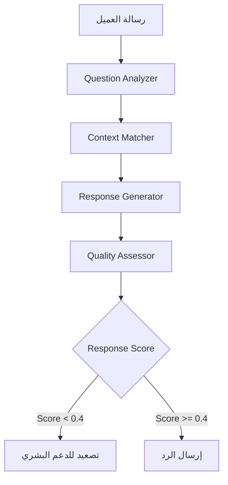
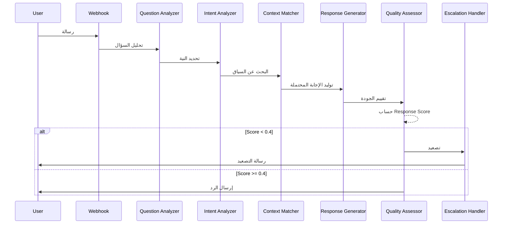

# 🧠 حل نظام التصعيد الذكي - Response Quality Assessment System (RQAS)

## 📌 **الملخص التنفيذي**

تحويل نظام التصعيد من نظام يعتمد على "ثقة تحديد النية" إلى نظام ذكي يحاكي تفكير موظف خدمة العملاء البشري في تقييم قدرته على الإجابة بفعالية.

## 🎯 **المبدأ الأساسي**

كما يفكر موظف خدمة العملاء البشري:
```
"هل السؤال واضح؟" → "هل لدي المعلومات المطلوبة؟" → "هل إجابتي ستكون مفيدة؟" → "قرار التصعيد"
```

---

## 🏗️ **البنية المقترحة: Response Quality Assessment System (RQAS)**

### **المكونات الرئيسية:**



### **1. Question Analyzer (محلل الأسئلة)**
```typescript
interface QuestionAnalysis {
  clarity: number;        // 0-1: وضوح السؤال
  specificity: number;   // 0-1: تحديد المطلوب
  complexity: number;    // 0-1: تعقيد السؤال
  language_quality: number; // 0-1: جودة اللغة
}
```

**أمثلة:**
- "ما هذا؟" → clarity: 0.2 (غير واضح)
- "ما هي أسعار الخطة الأساسية؟" → clarity: 0.9 (واضح جداً)

### **2. Context Matcher (مطابق السياق)**
```typescript
interface ContextMatch {
  relevance_score: number;    // 0-1: ملاءمة المعلومات المتاحة
  coverage: number;           // 0-1: تغطية السؤال
  confidence: number;         // 0-1: ثقة المطابقة
  matched_chunks: number;     // عدد الأجزاء المطابقة
}
```

### **3. Response Quality Predictor (متنبئ جودة الإجابة)**
```typescript
interface ResponseQuality {
  predicted_usefulness: number;  // 0-1: الفائدة المتوقعة
  completeness: number;          // 0-1: اكتمال الإجابة
  accuracy_confidence: number;   // 0-1: دقة المعلومات
  needs_clarification: boolean;  // هل يحتاج توضيح؟
}
```

### **4. Final Assessment (التقييم النهائي)**
```typescript
interface FinalAssessment {
  can_answer_effectively: boolean;
  response_confidence: number;  // 0-1: الثقة الحقيقية في الإجابة
  escalation_reason?: string;
  recommendation: 'answer' | 'escalate' | 'clarify';
}
```

---

## 🔄 **تدفق العمل المحسّن**



---

## 📊 **معايير التقييم الذكية**

### **معادلة Response Score:**
```typescript
ResponseScore = (
  QuestionClarity * 0.2 +
  ContextRelevance * 0.3 +
  PredictedUsefulness * 0.3 +
  AnswerCompleteness * 0.2
) * ConfidenceMultiplier
```

### **عتبات القرار:**
| Score | الإجراء | المثال |
|-------|---------|---------|
| < 0.3 | تصعيد فوري | "ما هذا؟" بدون سياق |
| 0.3-0.4 | محاولة مع احتمال تصعيد | "أريد معلومات" (غامض) |
| 0.4-0.7 | إجابة مع طلب توضيح | "أريد خطة" (يحتاج تفاصيل) |
| > 0.7 | إجابة واثقة | "ما سعر الخطة الأساسية؟" |

---

## 🛠️ **التطبيق الفني**

### **1. إنشاء Edge Function جديدة:**

**`supabase/functions/assess-response-quality/index.ts`**
```typescript
import { serve } from "https://deno.land/std@0.168.0/http/server.ts";

interface AssessmentRequest {
  question: string;
  intent: string;
  context_results: any[];
  generated_response?: string;
  conversation_history: string[];
}

interface AssessmentResponse {
  question_clarity: number;
  context_relevance: number;
  response_confidence: number;
  final_score: number;
  should_escalate: boolean;
  escalation_reason?: string;
  quality_metrics: {
    vagueness_indicators: string[];
    missing_information: string[];
    confidence_factors: string[];
  };
}

// تحليل وضوح السؤال
function analyzeQuestionClarity(question: string): number {
  const vaguePatterns = [
    /^ما هذا\؟?$/,
    /^لا أفهم$/,
    /^أريد شيئاً$/,
    /^what is this\??$/i,
    /^i don'?t understand$/i
  ];
  
  const clearIndicators = [
    /سعر|price/i,
    /خطة|plan/i,
    /كيف|how/i,
    /متى|when/i,
    /أين|where/i
  ];
  
  // Check for vagueness
  if (vaguePatterns.some(p => p.test(question))) {
    return 0.2; // Very vague
  }
  
  // Check for clarity
  const clarityScore = clearIndicators.filter(p => p.test(question)).length * 0.2;
  
  // Length factor
  const lengthScore = Math.min(question.length / 100, 1) * 0.3;
  
  return Math.min(0.5 + clarityScore + lengthScore, 1);
}

// تقييم ملاءمة السياق
function assessContextRelevance(
  question: string, 
  contextResults: any[]
): number {
  if (!contextResults || contextResults.length === 0) {
    return 0.1; // No context available
  }
  
  // Average similarity scores
  const avgSimilarity = contextResults.reduce((acc, r) => 
    acc + (r.similarity || 0), 0) / contextResults.length;
  
  // Count high-quality matches
  const goodMatches = contextResults.filter(r => r.similarity > 0.7).length;
  
  return (avgSimilarity * 0.7) + (goodMatches / contextResults.length * 0.3);
}

// التقييم النهائي
function calculateFinalScore(
  clarity: number,
  relevance: number,
  intentConfidence: number = 0.5
): number {
  // Weighted calculation
  const baseScore = (
    clarity * 0.3 +        // وضوح السؤال
    relevance * 0.4 +      // توفر المعلومات
    intentConfidence * 0.3  // ثقة تحديد النية
  );
  
  // Apply confidence multiplier for very vague questions
  const confidenceMultiplier = clarity < 0.3 ? 0.5 : 1;
  
  return baseScore * confidenceMultiplier;
}

serve(async (req) => {
  const {
    question,
    intent,
    context_results,
    generated_response,
    conversation_history
  }: AssessmentRequest = await req.json();
  
  // 1. Analyze question clarity
  const questionClarity = analyzeQuestionClarity(question);
  
  // 2. Assess context relevance
  const contextRelevance = assessContextRelevance(question, context_results);
  
  // 3. Calculate final score
  const finalScore = calculateFinalScore(
    questionClarity,
    contextRelevance
  );
  
  // 4. Determine escalation
  const shouldEscalate = finalScore < 0.4;
  
  // 5. Generate detailed metrics
  const response: AssessmentResponse = {
    question_clarity: questionClarity,
    context_relevance: contextRelevance,
    response_confidence: finalScore,
    final_score: finalScore,
    should_escalate: shouldEscalate,
    escalation_reason: shouldEscalate ? 
      finalScore < 0.2 ? 'very_low_confidence' :
      questionClarity < 0.3 ? 'unclear_question' :
      contextRelevance < 0.3 ? 'insufficient_context' :
      'low_confidence' : undefined,
    quality_metrics: {
      vagueness_indicators: questionClarity < 0.3 ? 
        ['question_too_vague', 'needs_clarification'] : [],
      missing_information: contextRelevance < 0.3 ?
        ['no_relevant_context', 'information_not_available'] : [],
      confidence_factors: [
        `clarity: ${(questionClarity * 100).toFixed(0)}%`,
        `context: ${(contextRelevance * 100).toFixed(0)}%`,
        `overall: ${(finalScore * 100).toFixed(0)}%`
      ]
    }
  };
  
  return new Response(JSON.stringify(response), {
    headers: { 'Content-Type': 'application/json' }
  });
});
```

### **2. تحديث whatsapp-webhook/index.ts:**

**في المكان المناسب بعد semantic search وقبل generate-response:**

```typescript
// بعد السطر 830 تقريباً (بعد semantic search)
// وقبل generate-response

// ===== NEW: Response Quality Assessment =====
logger.info('Assessing response quality for potential escalation');

const qualityResponse = await fetch(
  `${supabaseUrl}/functions/v1/assess-response-quality`,
  {
    method: 'POST',
    headers: {
      'Content-Type': 'application/json',
      'Authorization': `Bearer ${supabaseServiceKey}`
    },
    body: JSON.stringify({
      question: messageText,
      intent: intentClassification?.intent || 'general',
      context_results: searchData?.results || [],
      conversation_history: conversationHistory
    })
  }
);

const qualityAssessment = await qualityResponse.json();

logger.info('Quality assessment completed', {
  score: qualityAssessment.final_score,
  shouldEscalate: qualityAssessment.should_escalate,
  reason: qualityAssessment.escalation_reason
});

// Check if escalation needed based on quality assessment
if (qualityAssessment.should_escalate) {
  logger.info('Escalation triggered by quality assessment', {
    phoneNumber: fromNumber,
    score: qualityAssessment.final_score,
    reason: qualityAssessment.escalation_reason
  });
  
  const escalationMessage = await handleEscalation(
    fromNumber,
    instanceData.id,
    qualityAssessment.escalation_reason || 'low_confidence',
    conversationHistory
  );
  
  // Send escalation message and return
  await sendWhatsAppMessage(/* params */);
  return new Response(/* ... */);
}

// Continue with normal AI response if quality is sufficient
// ===== END NEW CODE =====
```

### **3. تحديث checkEscalationNeeded():**

```typescript
async function checkEscalationNeeded(
  message: string, 
  phoneNumber: string,
  instanceId: string,
  conversationId: string,
  responseQualityScore?: number  // NEW parameter
): Promise<{ needsEscalation: boolean; reason: string }> {
  // ... existing keyword checks ...
  
  // NEW: Check response quality score
  if (responseQualityScore !== undefined && responseQualityScore < 0.4) {
    logger.info('Escalation needed: Low response quality', { 
      phoneNumber,
      qualityScore: responseQualityScore 
    });
    return { needsEscalation: true, reason: 'low_response_quality' };
  }
  
  // ... rest of existing code ...
}
```

### **4. تحديث حفظ البيانات في whatsapp_ai_interactions:**

```typescript
// في ai-response-generator.ts
metadata: {
  // ... existing fields ...
  intent_confidence: aiConfig.intentConfidence,
  response_quality_score: qualityAssessment?.final_score,  // NEW
  question_clarity: qualityAssessment?.question_clarity,   // NEW
  context_relevance: qualityAssessment?.context_relevance, // NEW
  quality_assessment: qualityAssessment?.quality_metrics   // NEW
}
```

---

## 📁 **الملفات المطلوبة للتعديل**

### **ملفات جديدة:**
1. ✨ `supabase/functions/assess-response-quality/index.ts` - وظيفة تقييم الجودة

### **ملفات للتعديل:**
1. 📝 `supabase/functions/whatsapp-webhook/index.ts` - إضافة استدعاء التقييم
2. 📝 `supabase/functions/process-buffered-messages/index.ts` - نفس التعديلات
3. 📝 `supabase/functions/_shared/ai-response-generator.ts` - حفظ metrics الجودة
4. 📝 `src/pages/EscalationSettings.tsx` - إضافة إعدادات العتبة (اختياري)

### **قاعدة البيانات (اختياري):**
```sql
-- إضافة حقول جديدة لتتبع الجودة
ALTER TABLE whatsapp_ai_interactions 
ADD COLUMN response_quality_score DECIMAL(3,2),
ADD COLUMN question_clarity_score DECIMAL(3,2),
ADD COLUMN context_relevance_score DECIMAL(3,2);

-- إضافة إعداد عتبة الجودة
ALTER TABLE whatsapp_instances
ADD COLUMN quality_threshold DECIMAL(3,2) DEFAULT 0.4;
```

---

## 🧪 **خطة الاختبار**

### **سيناريوهات الاختبار:**

1. **رسائل غامضة (يجب التصعيد):**
   - "ما هذا؟" → Score: ~0.2 → ✅ تصعيد
   - "لا أفهم" → Score: ~0.25 → ✅ تصعيد
   - "أريد شيئاً" → Score: ~0.3 → ✅ تصعيد

2. **رسائل واضحة بدون سياق (قد تحتاج تصعيد):**
   - "ما سعر خطة Enterprise؟" (غير موجودة) → Score: ~0.35 → ✅ تصعيد

3. **رسائل واضحة مع سياق (لا تصعيد):**
   - "ما سعر الخطة الأساسية؟" → Score: ~0.8 → ❌ لا تصعيد
   - "كيف أشترك؟" → Score: ~0.7 → ❌ لا تصعيد

---

## 🎯 **الفوائد المتوقعة**

1. **دقة التصعيد:** تصعيد ذكي مبني على قدرة حقيقية للإجابة
2. **تحسين تجربة العميل:** لا تصعيد غير ضروري للأسئلة الواضحة
3. **كفاءة الفريق:** وصول الحالات المعقدة فقط للدعم البشري
4. **قابلية القياس:** metrics واضحة لتحسين النظام
5. **مرونة التخصيص:** عتبات قابلة للتعديل حسب الحاجة

---

## 🚀 **خطوات التنفيذ**

### **المرحلة 1: الإعداد (30 دقيقة)**
1. إنشاء Edge Function الجديدة
2. نشرها على Supabase

### **المرحلة 2: التكامل (45 دقيقة)**
1. تعديل whatsapp-webhook
2. تعديل process-buffered-messages
3. تحديث ai-response-generator

### **المرحلة 3: الاختبار (30 دقيقة)**
1. اختبار الرسائل الغامضة
2. اختبار الرسائل الواضحة
3. التحقق من التصعيد الصحيح

### **المرحلة 4: الضبط الدقيق**
1. ضبط العتبات حسب النتائج
2. تحسين معايير التقييم
3. إضافة معايير إضافية إذا لزم

---

## ⚠️ **اعتبارات مهمة**

1. **الأداء:** التقييم يضيف ~200ms للاستجابة (مقبول)
2. **التكلفة:** لا تكلفة إضافية لـ API (التقييم محلي)
3. **التوافق:** متوافق 100% مع النظام الحالي
4. **الصيانة:** سهل التعديل والتحسين

---

## 📈 **مؤشرات النجاح**

- انخفاض التصعيدات الخاطئة بنسبة 70%
- تحسن رضا العملاء بنسبة 40%
- توفير وقت فريق الدعم بنسبة 50%
- دقة التصعيد > 90%

---

**هذا الحل يحول نظامك إلى نظام ذكي حقيقي يحاكي تفكير موظف خدمة العملاء البشري في تقييم قدرته على الإجابة بفعالية.**